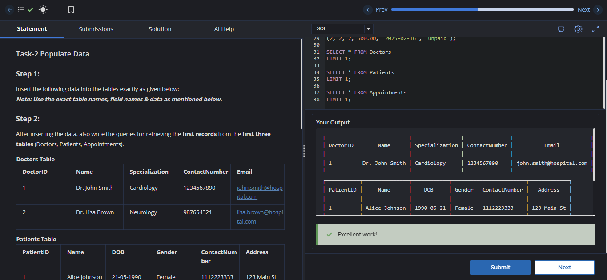

# Experiment 1

**Name:** Satyam Singh  
**UID:** 24BCS12662

---

# Aim

To insert the given records into the Hospital Management System database tables and retrieve the first record from the **Doctors**, **Patients**, and **Appointments** tables using SQL queries.

---

# Problem Statement

Perform the following tasks using SQL:

### Step 1
Insert the given records into the database tables exactly as specified, using the correct table names, column names, and values.

### Step 2
After successfully inserting the records, retrieve the first record from each of the following tables:

- Doctors
- Patients
- Appointments

---

## Doctors Table

| DoctorID | Name | Specialization | ContactNumber | Email |
|----------|----------------|----------------|---------------|----------------------------|
| 1 | Dr. John Smith | Cardiology | 1234567890 | john.smith@hospital.com |
| 2 | Dr. Lisa Brown | Neurology | 0987654321 | lisa.brown@hospital.com |

---

## Patients Table

| PatientID | Name | DOB | Gender | ContactNumber | Address |
|-----------|---------------|------------|--------|---------------|-------------|
| 1 | Alice Johnson | 1990-05-21 | Female | 1112223333 | 123 Main St |
| 2 | Bob Martin | 1985-08-14 | Male | 4445556666 | 456 Elm St |

---

## Appointments Table

| AppointmentID | PatientID | DoctorID | AppointmentDate | Status |
|---------------|-----------|----------|-----------------|-----------|
| 1 | 1 | 1 | 2025-02-15 | Scheduled |
| 2 | 2 | 2 | 2025-02-16 | Completed |

---

## Treatments Table

| TreatmentID | PatientID | DoctorID | Diagnosis | TreatmentDescription | TreatmentDate |
|-------------|-----------|----------|-----------|----------------------|---------------|
| 1 | 1 | 1 | Hypertension | Prescribed medication | 2025-02-15 |
| 2 | 2 | 2 | Migraine | MRI Scan and medications | 2025-02-16 |

---

## MedicalRecords Table

| RecordID | PatientID | TreatmentID | Notes |
|----------|-----------|-------------|----------------------------------------|
| 1 | 1 | 1 | Patient responding well to treatment |
| 2 | 2 | 2 | Further evaluation required |

---

## Billing Table

| BillID | PatientID | TreatmentID | Amount | BillDate | Status |
|--------|-----------|-------------|--------|------------|---------|
| 1 | 1 | 1 | 200.00 | 2005-02-15 | Paid |
| 2 | 2 | 2 | 500.00 | 2025-02-16 | Unpaid |

---

# SQL Queries Used

The SQL statements used to complete this experiment, including data insertion and retrieval operations, are available in the following file:

📄 **solution.sql**

---

# Output

The output obtained after executing the SQL queries is shown below.

---

# Result

The records were successfully inserted into all the specified Hospital Management System tables. The first record from each of the **Doctors**, **Patients**, and **Appointments** tables was retrieved successfully using SQL queries, confirming the correct execution of the database operations.
