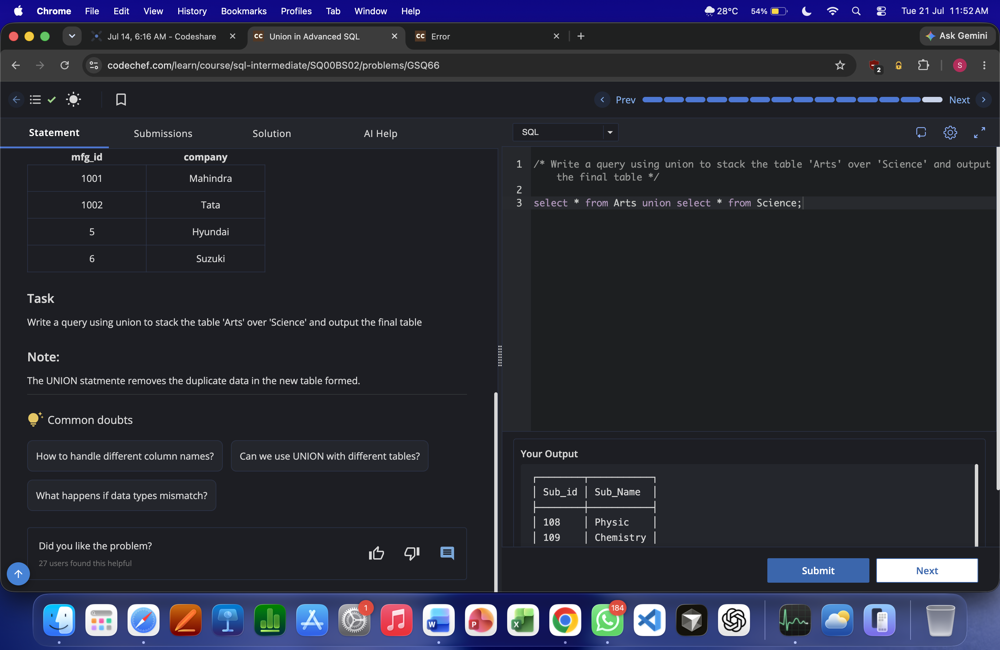
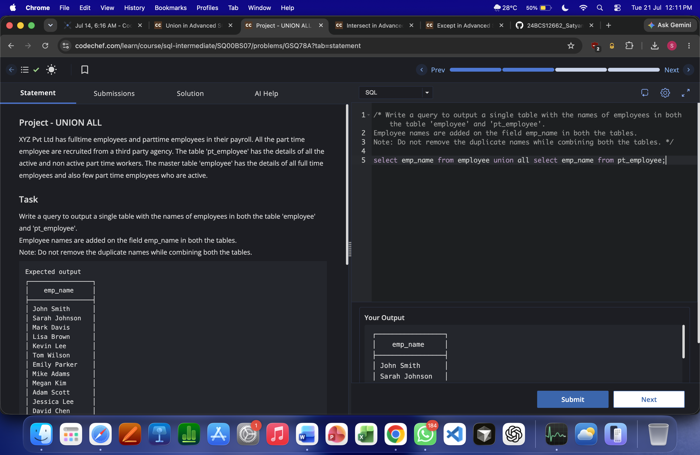
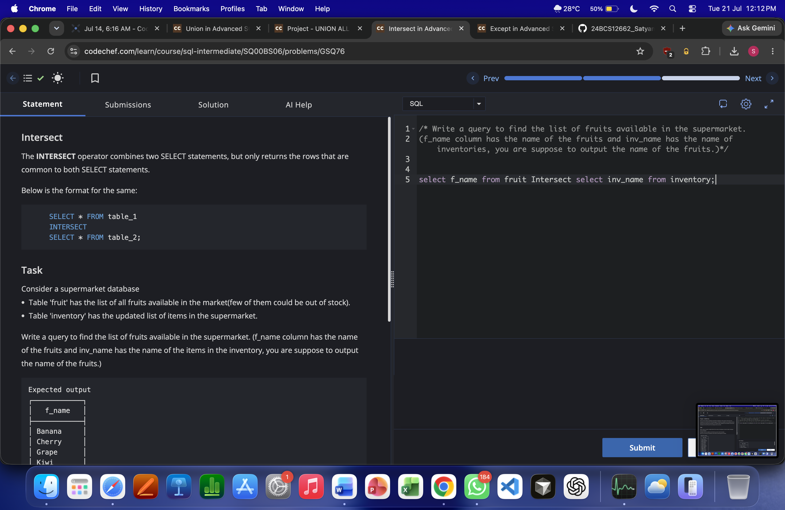
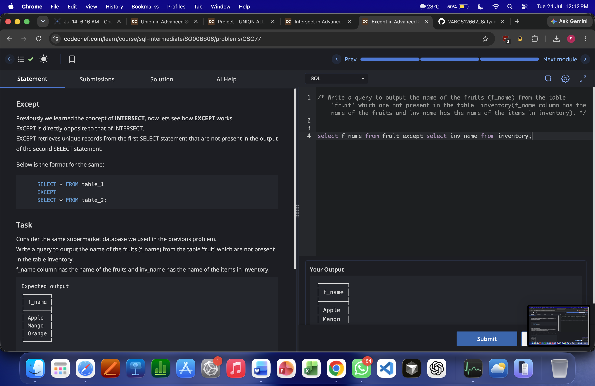

# Experiment 2

**Name:** Satyam Singh  
**UID:** 24BCS12662

## Aim

Perform SQL set operations (**UNION**, **UNION ALL**, **INTERSECT**, and **EXCEPT**) and observe the output.

## Problem Statements

1. Use **UNION** to stack table `Arts` over `Science`.
2. Use **UNION ALL** to combine employee names from `employee` and `pt_employee` without removing duplicates.
3. Use **INTERSECT** to find fruits available in both `fruit` and `inventory`.
4. Use **EXCEPT** to find fruits from `fruit` that are not present in `inventory`.

## SQL Queries

### 1) UNION ([union.sql](union.sql))

```sql
SELECT * FROM Arts
UNION
SELECT * FROM Science;
```

### 2) UNION ALL ([union-all.sql](union-all.sql))

```sql
SELECT emp_name FROM employee
UNION ALL
SELECT emp_name FROM pt_employee;
```

### 3) INTERSECT ([intersect.sql](intersect.sql))

```sql
SELECT f_name FROM fruit
INTERSECT
SELECT inv_name FROM inventory;
```

### 4) EXCEPT ([except.sql](except.sql))

```sql
SELECT f_name FROM fruit
EXCEPT
SELECT inv_name FROM inventory;
```

## Output Screenshots

### UNION


### UNION ALL


### INTERSECT


### EXCEPT


## Result

All set operation queries were executed successfully. The outputs for `UNION`, `UNION ALL`, `INTERSECT`, and `EXCEPT` matched the expected results.
