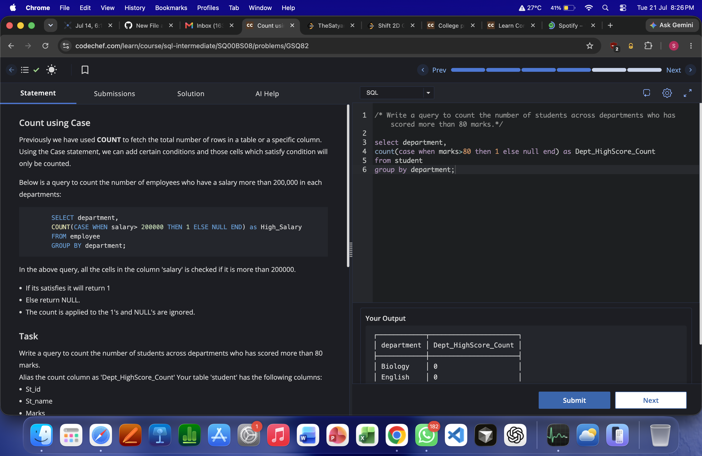
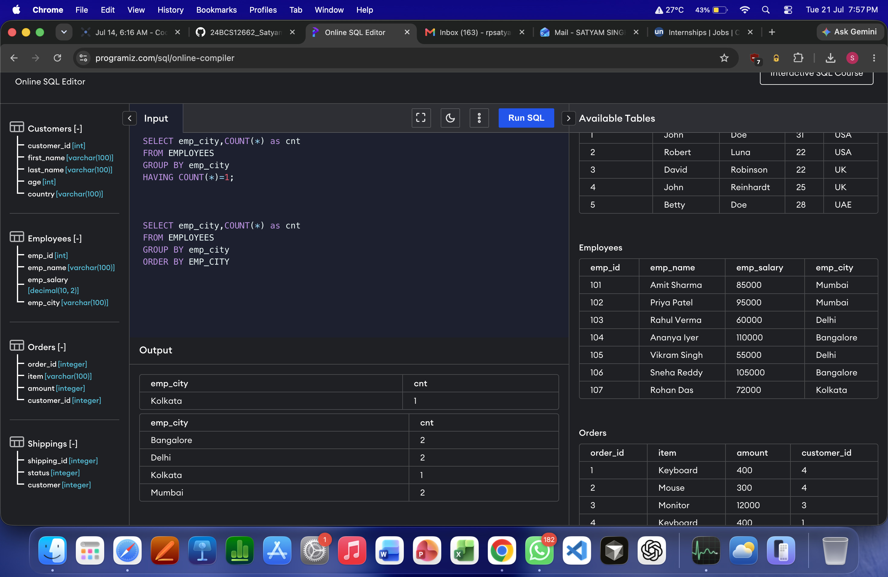
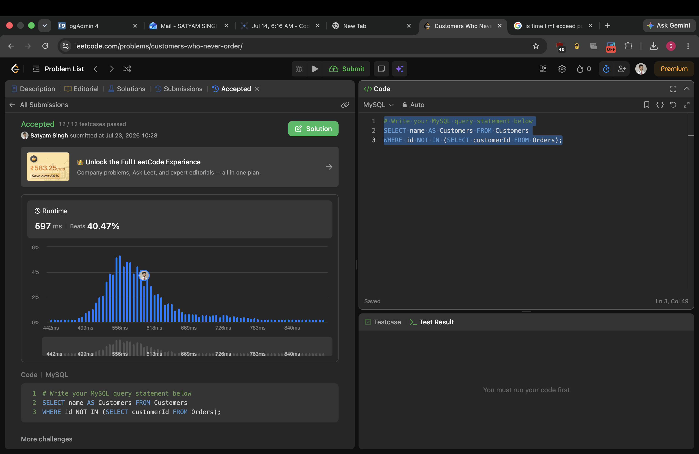
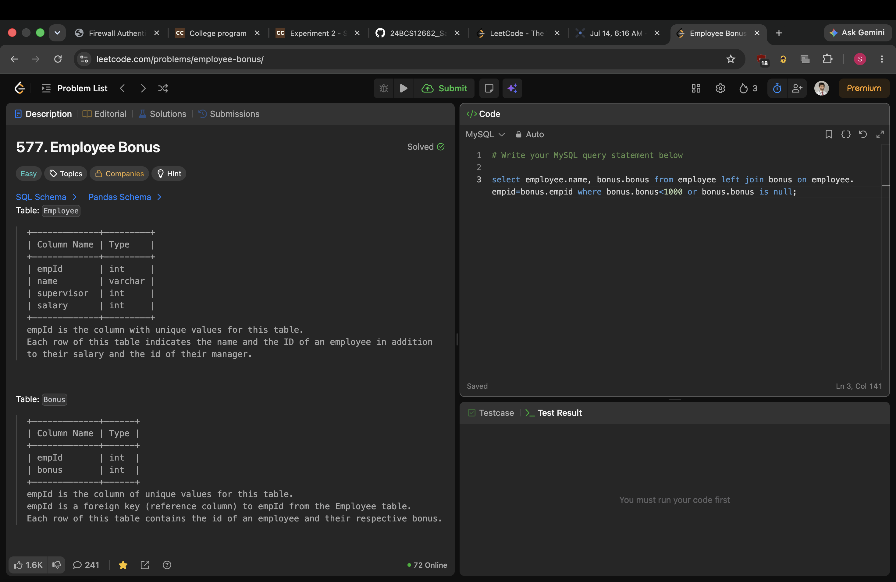

# Experiment 3

**Name:** Satyam Singh  
**UID:** 24BCS12662

## Aim

Practice SQL aggregation, filtering, and query-writing problems using `GROUP BY`, aggregate functions, and joins/subqueries.

## Question 1



### Answer 1 (SQL)

```sql
CREATE TABLE employees (
    emp_id INT PRIMARY KEY,
    emp_name VARCHAR(100) NOT NULL,
    emp_salary DECIMAL(10, 2) NOT NULL,
    emp_city VARCHAR(100) NOT NULL
);

INSERT INTO employees (emp_id, emp_name, emp_salary, emp_city) VALUES
(101, 'Amit Sharma', 85000.00, 'Mumbai'),
(102, 'Priya Patel', 95000.00, 'Mumbai'),
(103, 'Rahul Verma', 60000.00, 'Delhi'),
(104, 'Ananya Iyer', 110000.00, 'Bangalore'),
(105, 'Vikram Singh', 55000.00, 'Delhi'),
(106, 'Sneha Reddy', 105000.00, 'Bangalore'),
(107, 'Rohan Das', 72000.00, 'Kolkata');

SELECT emp_city, COUNT(*) AS cnt
FROM employees
GROUP BY emp_city;

SELECT emp_city, COUNT(*) AS cnt
FROM employees
GROUP BY emp_city
ORDER BY cnt ASC;

SELECT emp_city, COUNT(emp_id) AS cnt
FROM employees
GROUP BY emp_city
ORDER BY cnt;

SELECT emp_city, SUM(CASE WHEN emp_salary >= 90000 THEN 1 ELSE 0 END) AS cnt
FROM employees
GROUP BY emp_city
ORDER BY cnt DESC, emp_city DESC;

SELECT emp_city, COUNT(CASE WHEN emp_salary >= 90000 THEN 1 END) AS cnt
FROM employees
GROUP BY emp_city;

SELECT emp_city, MAX(emp_salary) AS max_salary
FROM employees
GROUP BY emp_city;

SELECT emp_city, MIN(emp_salary) AS min_salary
FROM employees
GROUP BY emp_city;

SELECT emp_city, MIN(emp_salary) AS min_salary
FROM employees
GROUP BY emp_city
HAVING MIN(emp_salary) >= 85000;

SELECT DISTINCT emp_city
FROM employees;
```

## Question 2



### Answer 2 (SQL)

```sql
SELECT department,
       COUNT(CASE WHEN marks > 80 THEN 1 ELSE NULL END) AS Dept_HighScore_Count
FROM student
GROUP BY department;
```

## Question 3



### Answer 3 (SQL)

```sql
SELECT name AS Customers
FROM Customers
WHERE id NOT IN (SELECT customerId FROM Orders);
```

## Question 4



### Answer 4 (SQL)

```sql
SELECT employee.name, bonus.bonus
FROM employee
LEFT JOIN bonus ON employee.empid = bonus.empid
WHERE bonus.bonus < 1000 OR bonus.bonus IS NULL;
```

## Result

All four SQL tasks were completed successfully, and the queries produced the expected outputs.
