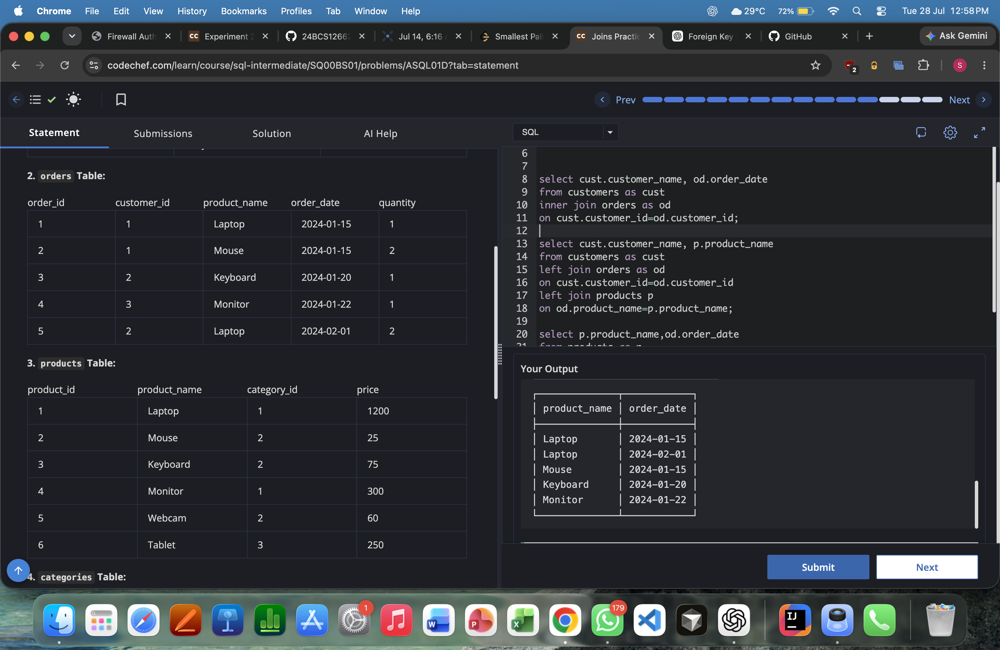
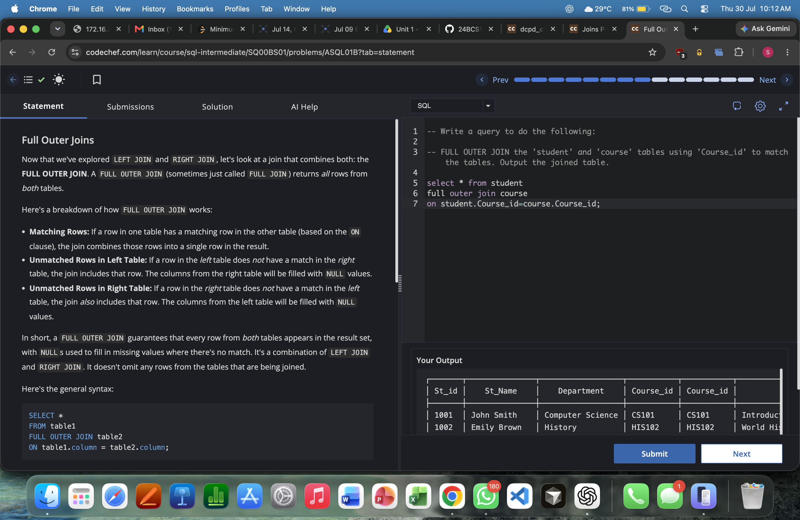
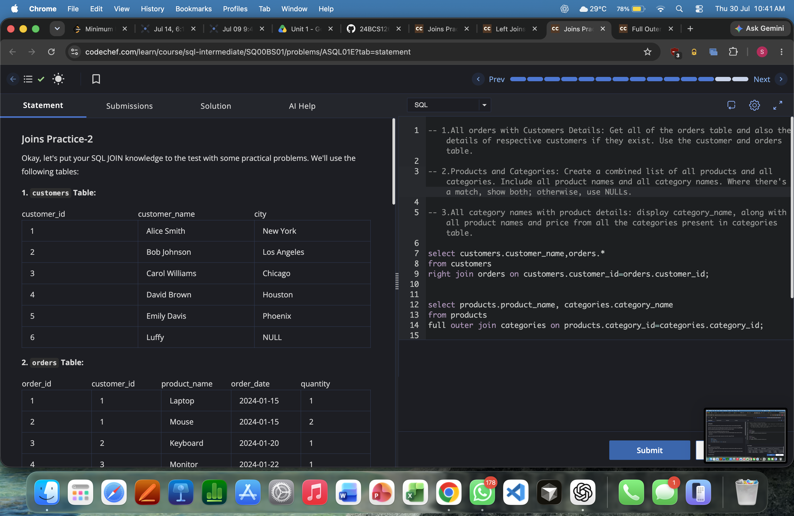
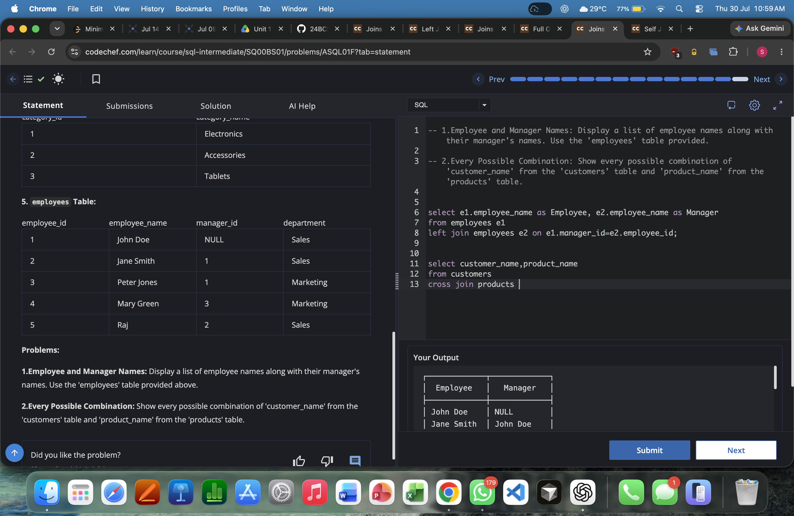
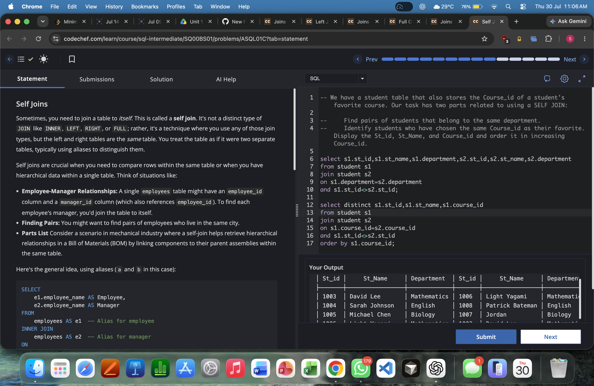

# Experiment 4: SQL JOIN Operations

**Name:** Satyam Singh  
**UID:** 24BCS12662

## Aim

To practice SQL JOIN operations across multiple tables and display the required results.

## Problem Statements

1. List `customer_name` and `order_date` for all customers who have placed orders.
2. List all customer names and their corresponding `product_name`, including customers who have not placed any orders.
3. Display `product_name` and `order_date` for all products that are ordered.
4. Perform a `FULL OUTER JOIN` on `student` and `course` tables using `Course_id`.
5. Display employee names along with their manager names, and show every possible customer-product combination.
6. Use self joins on `student` to find students from the same department and students with the same favorite `Course_id`.

## SQL Queries Used

### 1) Customers and Order Dates

```sql
select cust.customer_name, od.order_date
from customers as cust
inner join orders as od
on cust.customer_id = od.customer_id;
```

### 2) All Customers with Products (Including Customers with No Orders)

```sql
select cust.customer_name, p.product_name
from customers as cust
left join orders as od
on cust.customer_id = od.customer_id
left join products p
on od.product_name = p.product_name;
```

### 3) Products and Their Order Dates

```sql
select p.product_name, od.order_date
from products as p
inner join orders as od
on p.product_name = od.product_name;
```

### 4) FULL OUTER JOIN on Student and Course

```sql
select *
from student
full outer join course
on student.Course_id = course.Course_id;
```

### 5) Employee-Manager and Customer-Product Combinations

```sql
select e1.employee_name as Employee, e2.employee_name as Manager
from employees e1
left join employees e2 on e1.manager_id=e2.employee_id;

select customer_name,product_name
from customers
cross join products;
```

### 6) Self Join on Student Table

```sql
select s1.st_id,s1.st_name,s1.department,s2.st_id,s2.st_name,s2.department
from student s1
join student s2
on s1.department=s2.department
and s1.st_id<>s2.st_id;

select distinct s1.st_id,s1.st_name,s1.course_id
from student s1
join student s2
on s1.course_id=s2.course_id
and s1.st_id<>s2.st_id
order by s1.course_id;
```

## Output Screenshots

### Output 4.1


### Output 4.2


### Output 4.3


### Output 4.4


### Output 4.5


### Output 4.6


## Result

All required JOIN queries were executed successfully, and the outputs matched the expected results.
