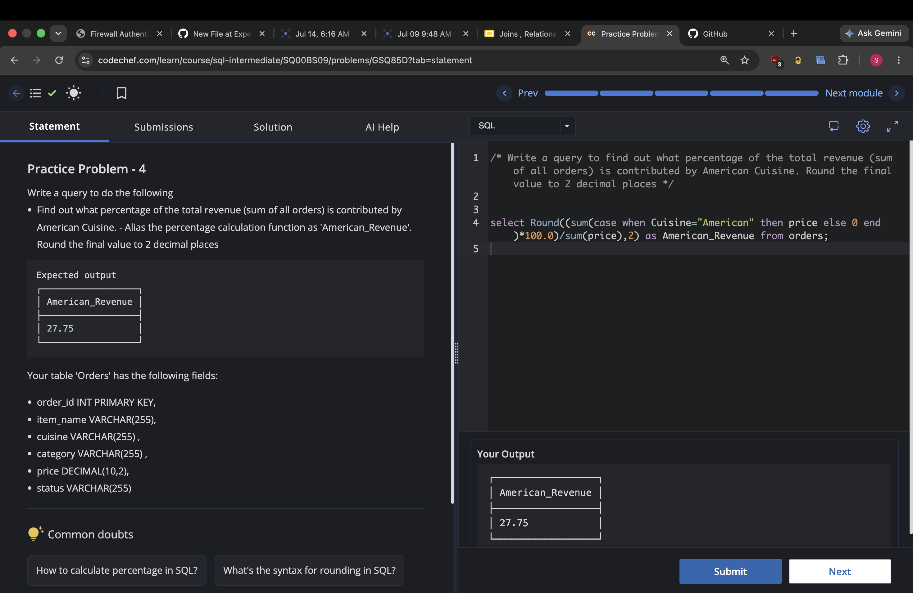
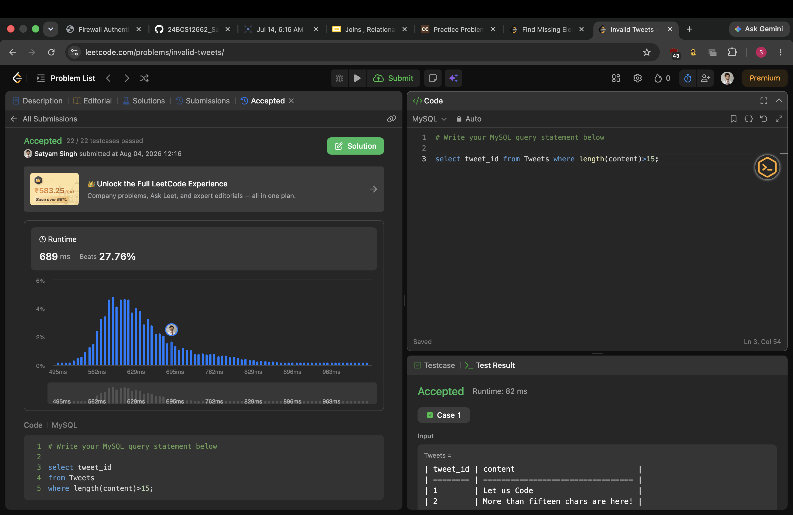
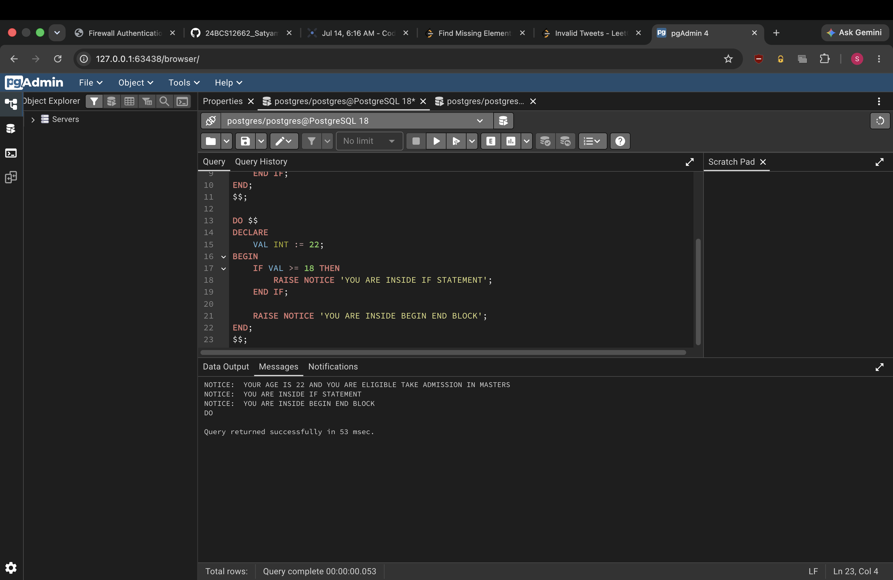

# Experiment 5

**Name:** Satyam Singh  
**UID:** 24BCS12662

## Aim

Practice SQL problem-solving with aggregate logic, string functions, and conditional statements.

## Problem Statements

1. Find what percentage of total revenue is contributed by American cuisine and round it to 2 decimal places.
2. Retrieve `tweet_id` values where tweet content length is greater than 15 characters.
3. Use procedural conditional logic to print eligibility messages based on age values.

## SQL Queries

### 1) Revenue Percentage by Cuisine ([5.1.sql](5.1.sql))

```sql
SELECT ROUND((SUM(CASE WHEN Cuisine = "American" THEN price ELSE 0 END) * 100.0) / SUM(price), 2) AS American_Revenue
FROM orders;
```

### 2) Tweets with Content Length > 15 ([5.2.sql](5.2.sql))

```sql
SELECT tweet_id
FROM Tweets
WHERE LENGTH(content) > 15;
```

### 3) Conditional Logic with DO Blocks ([5.3.sql](5.3.sql))

```sql
DO $$
DECLARE
    AGE INT := 22;
BEGIN
    IF AGE >= 18 AND AGE < 21 THEN
        RAISE NOTICE 'YOUR AGE IS % AND YOU ARE ELIGIBLE TAKE ADMISSION IN BACHELORS', AGE;
    ELSIF AGE >= 21 THEN
        RAISE NOTICE 'YOUR AGE IS % AND YOU ARE ELIGIBLE TAKE ADMISSION IN MASTERS', AGE;
    END IF;
END;
$$

DO $$
DECLARE
    VAL INT := 22;
BEGIN
    IF VAL >= 18 THEN
        RAISE NOTICE 'YOU ARE INSIDE IF STATEMENT';
    END IF;

    RAISE NOTICE 'YOU ARE INSIDE BEGIN END BLOCK';
END;
$$
```

## Output Screenshots

### Output 5.1


### Output 5.2


### Output 5.3


## Result

All assigned SQL tasks were completed successfully, and the expected outputs were obtained.
