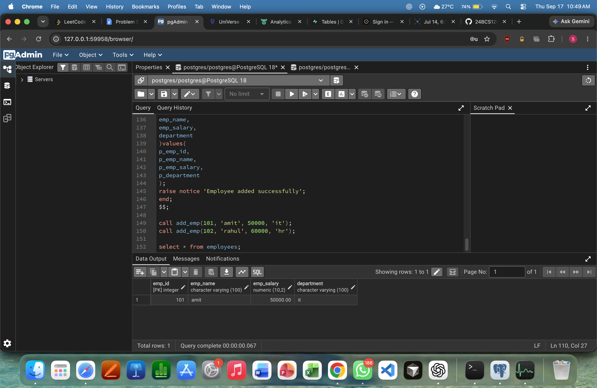

# Experiment 8

**Name:** Satyam Singh  
**UID:** 24BCS12662

## Aim

Use a cursor to fetch and display top employee records based on salary.

## Problem Statement

Create a cursor over employee salary data and print the top 5 highest-paid employees.

## SQL Query

### Cursor-Based Top 5 Salaries ([8.sql](8.sql))

```sql
DECLARE
    CURSOR c_employee IS
        SELECT name, salary
        FROM employee
        ORDER BY salary DESC;

    v_count NUMBER := 0;

BEGIN
    FOR emp IN c_employee LOOP
        EXIT WHEN v_count = 5;

        dbms_output.put_line(
            'name: ' || emp.name || ', salary: ' || emp.salary
        );

        v_count := v_count + 1;
    END LOOP;
END;
/
```

## Output



## Result

Top employee records were retrieved and displayed successfully using a cursor.
