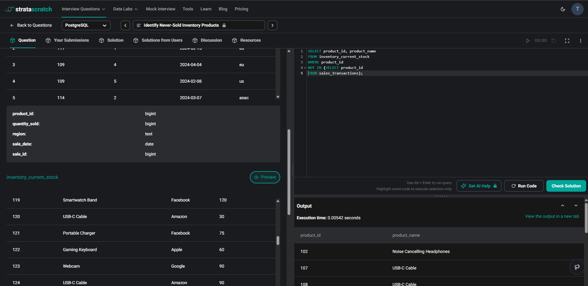

# Overview of Databases

## Question

## Answer

A database is an organized collection of data that enables efficient storage, retrieval, and management of information. A DBMS provides features such as data consistency, security, backup/recovery, and controlled multi-user access. Common database models include hierarchical, network, relational, and NoSQL systems.
