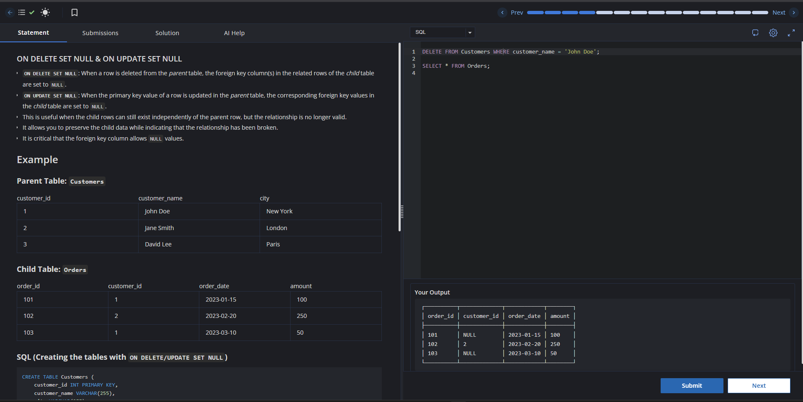

# Relational Data Structure

## Question

## Answer

A relational data structure stores information in tables (relations) made of rows (tuples) and columns (attributes). Tables are connected through keys: a primary key uniquely identifies each row, while foreign keys define relationships between tables. This model reduces redundancy, improves data integrity, and supports powerful querying through SQL.
